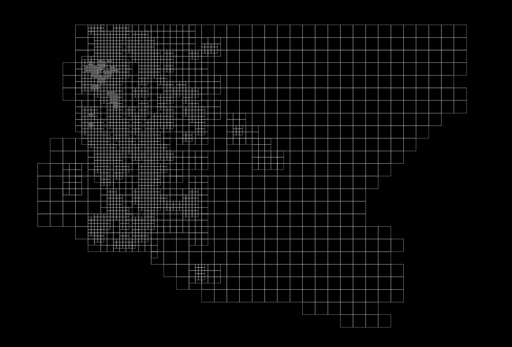

# parcelier

```parceler``` is a Go CLI that extracts and converts GeoJSON from an ESRI MapServer endpoint, mostly aimed at county parcel websites. In some regards, it's a more limited version of [openaddresses/pyesridump](https://github.com/openaddresses/pyesridump).

I've found it useful to pair with some other GeoJSON tools like [engelsjk/gjfunks](https://github.com/engelsjk/gjfunks) and [stedolan/jq](https://github.com/stedolan/jq).

## What

```parcelier``` is primarily intended for extracting parcel boundary data from US county GIS websites. At a high level, this tool takes in a boundary GeoJSON file of a specific county, tiles the boundary at a specified zoom level and then iteratively requests features from an ESRI MapServer REST endpoint for each tile boundary. The response data is returned as GeoJSON (or converted to such) and each tile worth of data is then saved as a GeoJSON file to disk.

For tile requests that exceeded the server feature limit (typically 1000 features), ```parcelier``` will up-tile to higher zoom levels until the requested number of features is below the limit to ensure complete coverage. This up-tiling process might look something like this.



There are arguably better or more efficiently ways to accomplish this specific task. This is only one way that I've found to work reasonably well.

## Help

```bash
parcelier --help
```

```bash
usage: parcelier [<flags>]

Flags:
      --help              Show context-sensitive help (also try --help-long and --help-man).
  -b, --boundary=""       boundary filepath
      --extent=""         extent tile (z/x/y)
      --url=""            esri url
  -z, --zoom=13           initial zoom
  -o, --output="."        parcel output dir
  -t, --tiles=""          tile output dir
  -s, --sr="4326"         spatial reference system
  -i, --id="OBJECTID"     parcel object id key
  -p, --pin="PIN"         parcel pin key
  -f, --format="geojson"  format
  -w, --wait=500          query wait (ms)
  -u, --update            update existing files
  -v, --verbose           verbose
      --vv                very verbose
```

## Commands

```bash
parcelier \
-b "boundary.geojson" \
--url "https://gis.website.com/arcgis/rest/services/Parcels/MapServer/0" \
-i "FID" \
-p "PIN" \
-f "geoJSON" \
-w 100 \
-z 13 \
-s "4326" \
-t "tiles" \
-o "parcels"
```

```bash
gjbuild \
-o "parcels.ndjson" \
--filter-key="PIN" \
--ndjson \
parcels
```

```bash
jq \
-c \
'.properties' \
parcels.ndjson > \
properties.ndjson
```